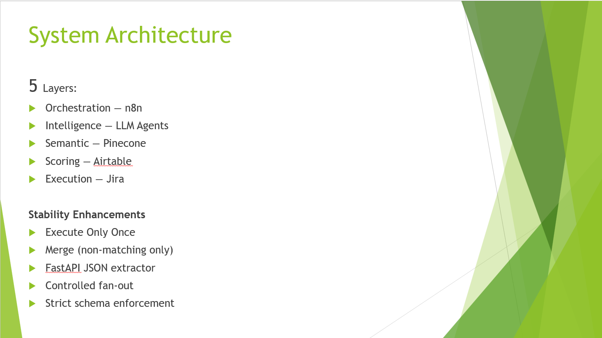

🚀 Product Feedback Intelligence & Roadmap Prioritization Engine

LLM-powered system that transforms unstructured customer feedback into structured, explainable, and execution-ready roadmap decisions using Retrieval-Augmented Generation (RAG) and agentic workflows.

📌 Problem Statement

Product teams receive massive volumes of unstructured feedback from app stores and customer channels. Manual triaging is slow, subjective, and lacks transparent prioritization.

This project builds an automated AI-driven pipeline that:

Classifies feedback

Clusters recurring issues

Prioritizes transparently

Creates execution-ready Jira tickets

🧠 Architecture Overview

This system follows a 5-layer production-style architecture:

1️⃣ Ingestion Layer

Kaggle App Store Reviews

Synthetic edge-case feedback

Schema normalization & validation

2️⃣ Intelligence Layer

2-Pass LLM Architecture

Pass 1: Classification (Bug / Feature / Usability)

Pass 2: Granular Theme Clustering

Few-shot prompting

Strict JSON schema enforcement

3️⃣ Semantic Layer

Embedding generation

Pinecone vector storage

Semantic similarity retrieval

Namespace separation

4️⃣ Scoring Layer

Airtable-based impact scoring

Transparent, business-readable prioritization

5️⃣ Execution Layer

Automated Jira ticket creation

One-theme → one-ticket mapping

Deduplication logic

Execute-once workflow control

⚙️ Key Features

LLM-based structured classification

Granular issue clustering

Retrieval-Augmented pipeline

FastAPI-based JSON validation

Idempotent workflow re-execution

Controlled fan-out execution in n8n

Production-like stability controls

🔁 Execution Flow

Review ingestion

LLM classification

Embedding generation

Vector storage in Pinecone

Semantic retrieval

Theme clustering

Airtable scoring

Jira automation

🛠 Tech Stack

Python

OpenAI APIs

LangChain

Pinecone

n8n

FastAPI

Airtable

Jira

📊 Results

471 vectors stored in Pinecone

Noise-resilient classification

Explainable prioritization logic

Strict one-theme-to-one-ticket mapping

Stable re-runnable workflow architecture

🔮 Future Improvements

Real-time Slack integration

Feedback drift monitoring

Executive analytics dashboard

Continuous learning loop[Capstone_Group 5_Project Report - Product Feedback Intelligence & Roadmap Prioritization Engine.docx](https://github.com/user-attachments/files/25482536/Capstone_Group.5_Project.Report.-.Product.Feedback.Intelligence.Roadmap.Prioritization.Engine.docx)
[Capstone_Group 5_Project Report - Product Feedback Intelligence & Roadmap Prioritization Engine (2).pptx](https://github.com/user-attachments/files/25482554/Capstone_Group.5_Project.Report.-.Product.Feedback.Intelligence.Roadmap.Prioritization.Engine.2.pptx)
